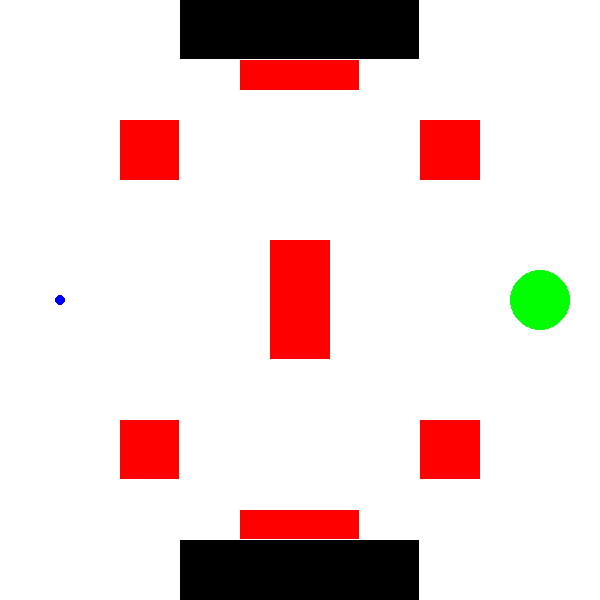
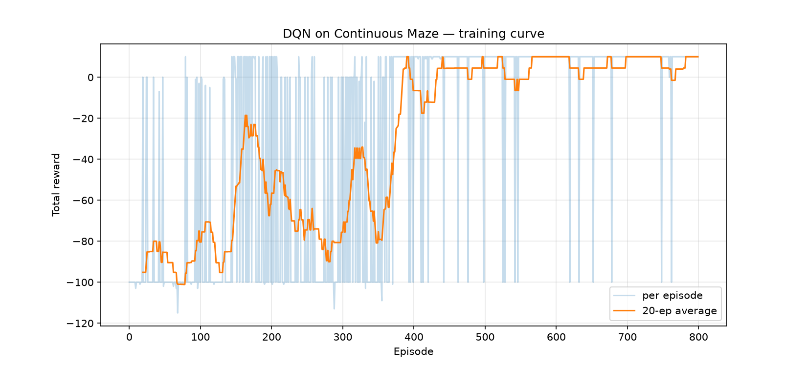
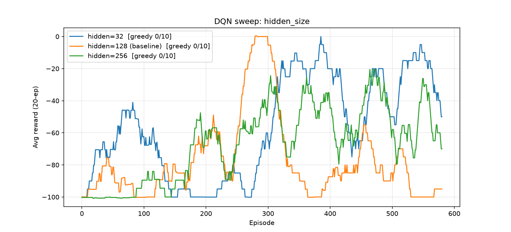
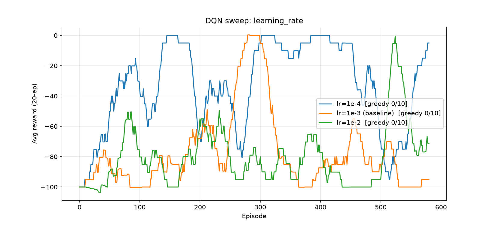
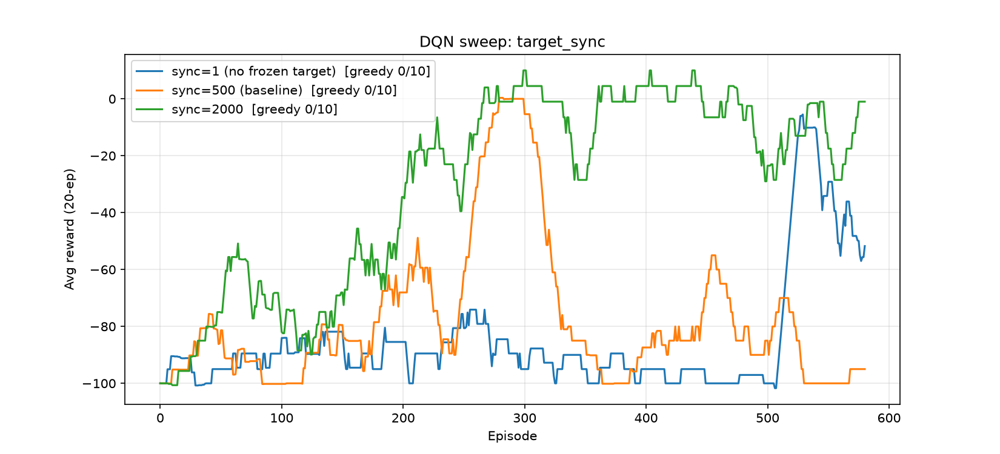

# Deep Q-Learning — Continuous Maze

A [Deep Q-Network (DQN)](https://www.nature.com/articles/nature14236) agent that learns to navigate a continuous 2D maze, reaching a goal region while avoiding danger zones and walls. Built with PyTorch and a custom [Gymnasium](https://gymnasium.farama.org/) environment rendered with Pygame.



## The environment

`ContinuousMazeEnv` (`env.py`) is a custom `gymnasium.Env`:

| Property | Value |
| --- | --- |
| **State** | 2D continuous position `(x, y)`, each normalized to `[0, 1]` |
| **Actions** | Discrete: `0=up`, `1=down`, `2=left`, `3=right` (step size `0.05`) |
| **Start** | `(0.1, 0.5)` |
| **Goal** | Green circle at `(0.9, 0.5)`, radius `0.05` → reward `+10`, episode ends |
| **Danger zones** | 7 red rectangles → reward `-100`, episode ends |
| **Walls** | 2 black rectangles → reward `-1`, agent bounces back (stays put) |

The agent must cross the maze from left to right, threading between danger zones with a central wall of hazards blocking the direct path.

## The agent

`dqn_agent.py` implements a standard DQN with the usual stabilizing tricks:

- **Q-network** — a 3-layer MLP (`2 → hidden → hidden → 4`) with ReLU activations, approximating `Q(s, ·)` over the four actions.
- **Experience replay** — a `ReplayBuffer` (capacity 50k) stores `(s, a, r, s', done)` transitions and serves random minibatches to decorrelate updates.
- **Target network** — a frozen copy of the Q-network provides bootstrap targets, synced every `target_sync_every` learn-steps.
- **Huber loss** (`SmoothL1Loss`) with gradient-norm clipping at `10.0`, optimized with Adam.
- **ε-greedy exploration** with per-episode multiplicative decay (`1.0 → 0.05`).

## Files

| File | Purpose |
| --- | --- |
| `env.py` | The continuous maze environment (Gymnasium + Pygame). Run directly to visualize random rollouts. |
| `dqn_agent.py` | `QNetwork`, `ReplayBuffer`, and `DQNAgent` (act / train / save / load). |
| `main.py` | Train the agent (800 episodes), save weights to `dqn_maze.pt`, and plot `training_curve.png`. |
| `play_dqn.py` | Load the trained model and watch 10 greedy rollouts in a Pygame window; reports success rate. |
| `record_dqn.py` | Record a greedy rollout to `dqn_solution.gif` and `dqn_solution.mp4`. |
| `experiments.py` | Hyperparameter sweeps over hidden size, learning rate, and target-sync interval; saves `sweep_*.png`. |

## Usage

Install dependencies:

```bash
pip install torch numpy matplotlib gymnasium pygame imageio
```

Train the agent (headless; produces `dqn_maze.pt` and `training_curve.png`):

```bash
python main.py
```

Watch the trained agent (opens a Pygame window):

```bash
python play_dqn.py
```

Record the solution as GIF/MP4:

```bash
python record_dqn.py
```

Run the hyperparameter sweeps:

```bash
python experiments.py
```

## Results

Training converges to a policy that reliably reaches the goal. The reward curve below shows per-episode reward and its 20-episode moving average:



### Hyperparameter sweeps

Each sweep trains for 600 episodes and evaluates greedy success over 10 rollouts.

| Sweep | Values compared |
| --- | --- |
| **Hidden size** | 32 / 128 / 256 |
| **Learning rate** | 1e-4 / 1e-3 / 1e-2 |
| **Target sync** | 1 (no frozen target) / 500 / 2000 |





## Default hyperparameters

Set in `main.py`:

| | |
| --- | --- |
| Episodes | 800 |
| Max steps / episode | 300 |
| Discount `γ` | 0.99 |
| Learning rate | 1e-3 |
| Hidden units | 128 |
| Batch size | 64 |
| Replay capacity | 50,000 |
| Target sync interval | 500 learn-steps |
| ε start / end / decay | 1.0 / 0.05 / 0.995 |
